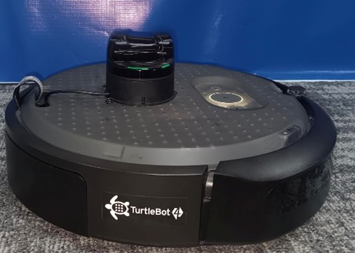
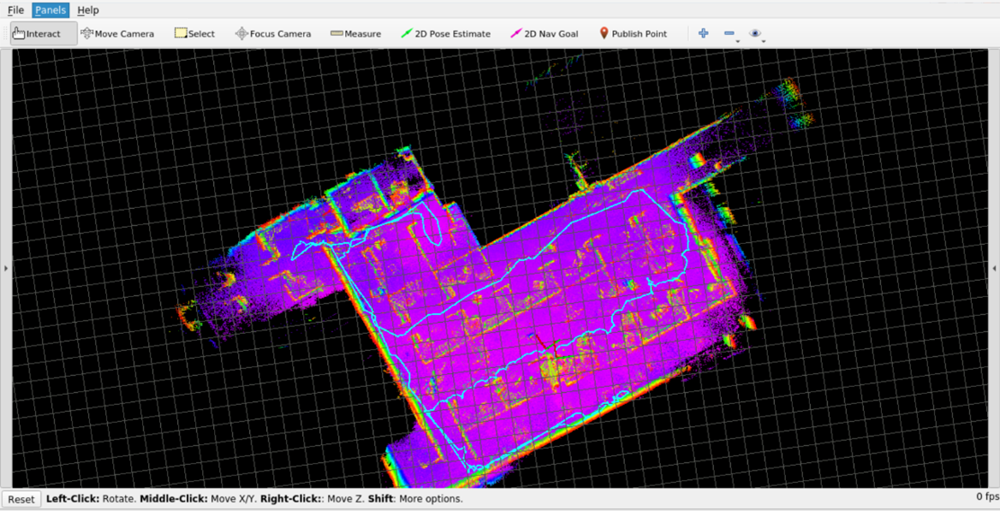
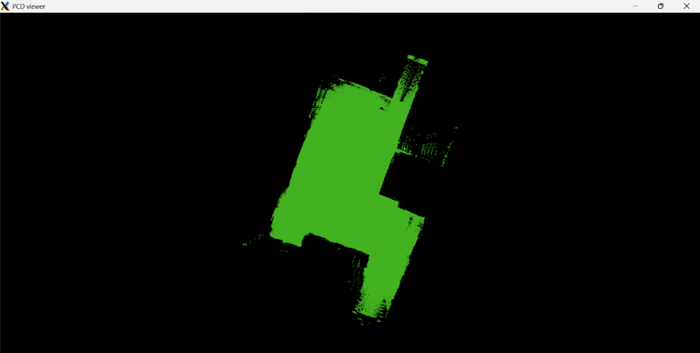

# RB3-Based Unitree 4D L1 LiDAR Mapping Framework with TurtleBot4 

## Introduction

This project develops a portable indoor robotic mapping system that generates accurate 3D maps in real time. It combines the TurtleBot4 mobile platform, a high-precision LiDAR sensor, and the Qualcomm RB3 development board (QCS6490) for SLAM and perception. The RB3 processes 3D scan data on-device using its heterogeneous compute architecture. Modular ROS environments are deployed via Docker across both devices, enabling scalable, flexible development. The system supports robust localization and is designed for future advancements in autonomous navigation and robotics research.

## Setup Guide

### Hardware Requirements
 
| Equipment                 | Description                                 |
|---------------------------|---------------------------------------------|
| RB5 Development Board     | Qualcomm's latest Robotics platform         |
| Power Adapter             | 12V/2.5A adapter (as per 96Boards spec)     |
| USB to Micro USB Cable    | For serial console (ADB/Fastboot)           |
| USB to USB Type C Cable   | For flashing and data transfer              |
| TurtleBot4 (Burger Model) | Mobile robot for mapping and localization   |
| Unitree LiDAR L1          | 4D LiDAR sensor for TurtleBot4              |




### Software Requirements
 
Install the following tools and packages:
 
| Software                  | Version / Link                                                   |
|---------------------------|-------------------------------------------------------------------|
| Ubuntu                    | 20.04 (inside Docker), 22.04 (host TurtleBot4)                   |
| ROS1 Noetic | [Installation Guide](http://wiki.ros.org/noetic/Installation)   |
| Docker | [https://docs.docker.com/engine/install/ubuntu/](https://docs.docker.com/engine/install/ubuntu/) |
| Git                       | `sudo apt install git`                                           |
| CMake                     | `sudo apt install cmake`                                         |
| colcon (ROS1 build tool)  | `sudo apt install python3-colcon-common-extensions`              |
| Unilidar SDK              | Provided during implementation                                   |
 

### Steps to Set Up LiDAR

- Mount and connect the LiDAR sensor to the TurtleBot4.  
- Supply power to the LiDAR using TurtleBot4’s 12V DC output.  
- Connect the LiDAR’s data cable to the onboard Raspberry Pi for data communication. 


### Steps to Set Up Turtlebot4

#### • Check USB Setup and LiDAR Detection

1. Connect the Unitree LiDAR (L1) to TurtleBot4 via USB.  
2. Verify the device is detected:
   ```bash
   lsusb
   dmesg | grep ttyUSB
   ```
   
3. Confirm the LiDAR is publishing data:
   ```bash
   ls /dev/ttyUSB0
   ```
   

#### • 	Steps to Build Custom ROS1 (Noetic) Docker Image Inside Turtlebot4:

1.	Clone the Repository
    ```bash
    git clone <repository-url>
    ```
2.	Navigate to the Dockerfile Directory
    ```bash
    cd turtlebot4_docker
    ```
3.	Build the Docker Image
    ```bash
    sudo docker build -t turtlebot4-4d-lidar .
    ```
4.	Verify the Image Was Built
    ```bash
    sudo docker images
    ```
    


#### • Run the Docker Image

```bash
docker run -it --network host \
-e DISPLAY=<ip of host machine for display>:0 \
-v /tmp/.X11-unix:/tmp/.X11-unix turtlebot4-4d-lidar
```


#### • Build the Unitree LiDAR ROS1 Driver

```bash
cd unilidar_sdk/unitree_lidar_ros
catkin_make
source devel/setup.bash
```

>  **Note:** Source the ROS package environment  or add it to your `~/.bashrc`.

#### • Launch and Verify LiDAR Data

1. Launch the ROS node for the Unitree LiDAR:
   ```bash
   roslaunch unitree_lidar_ros run.launch
   ```
2. Open RViz and verify the LiDAR point cloud data.
 

### Steps to Set Up RB3

#### • Install ROS1 (Noetic) Docker Image

1.	Clone the Repository
    ```bash
    git clone <repository-url>
    ```
2.	Navigate to the Dockerfile Directory
    ```bash
    cd rb3_docker
    ```
3.	Build the Docker Image
    ```bash
    docker build -t rb3-4d-lidar .
    ```
4.	Verify the Image Was Built
    ```bash
    docker images
    ```
    


#### • Run the Docker Image

Start the Docker container:
```bash
docker run -it --network host \
-e DISPLAY=<host-machine-ip>:0 \
-v /tmp/.X11-unix:/tmp/.X11-unix rb3-4d-lidar 
```

#### • Compile and Build It

```bash
cd catkin_point_lio_unilidar/src
cd ..
catkin_make
source devel/setup.bash
```

>  **Note:** Source it always or add it in your `~/.bashrc` file.


### Turtlebot4 and RB3 Communication Setup

#### 1. Update the `~/.bashrc` File
Add the following lines to the `~/.bashrc` file on **both RB3 and Turtlebot4 Docker containers**:

```bash
# Source ROS environment
source /opt/ros/noetic/setup.bash

# Set ROS master URI and IP (adjust according to host (RB3) / Turtlebot4)
export ROS_MASTER_URI=http://<master-ip>:11311
export ROS_HOSTNAME=<this-device-ip>
```
- Replace <master-ip> with the IP address of the ROS master ( Turtlebot4)
- Replace <this-device-ip> with the IP address of the current device (RB3 or Turtlebot4).

#### 2. Source the ~/.bashrc File
After updating the ~/.bashrc file, apply the changes by running the following command:
````bash
source ~/.bashrc
````
#### 3. Verify the Setup
To ensure the communication setup is working, check the ROS topics on both Docker containers:
List all available topics:
````bash
rostopic list
````
Echo any topic to verify data transmission:
```bash
rostopic echo <any_topic>
````
**Note**: Ensure that both devices (RB3 and Turtlebot4) are connected to the same network.

## Execution Instructions

Follow the steps below to execute the required commands for setting up and running the Turtlebot4 and RB3 communication with the Unitree 4D LiDAR SDK and Point LIO SDK.

---

###  • On Turtlebot4 Docker container
Launch the Unitree 4D LiDAR SDK by running the following commands:

```bash
cd unilidar_sdk/unitree_lidar_ros
source devel/setup.bash
roslaunch unitree_lidar_ros run_without_rviz.launch
```


### • On RB3 Docker Container
Launch the Point LIO SDK by running the following commands:
bash
```bash
cd catkin_unilidar_point_lio
source devel/setup.bash
roslaunch point_lio_unilidar mapping_unilidar_l1.launch
```


### • Turtlebot4 Shell

Source the ROS 2 Humble environment and run the teleoperation package to control the robot:
```bash
ros2 run teleop_twist_keyboard teleop_twist_keyboard
```
Use the teleop_twist_keyboard package to manually control the robot and move it across the surroundings to collect LiDAR data for mapping.


Below is an example of mapping visualization on Rviz:


​

Once the run is complete, all cached point cloud map data will be saved to the following path: 

```bash
 ~/catkin_point_lio_unilidar/src/point_lio_unilidarPCD/scans.pcd 
```
You can use the pcl_viewer tool to view this pcd file:
```bash
pcl_viewer scans.pcd 
```

